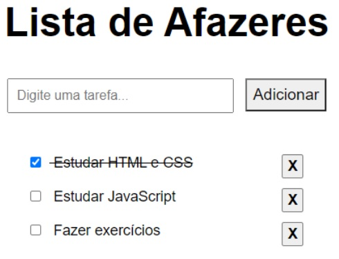

<header>
    <h1 align="center">
        Lista de Afazeres
    </h1>
</header>

<main>
<!-- DESCRIÇÃO -->
    <section>
        

            <h2>Modulo #1</h2>
            <h3>Projeto #1</h3>
            

                <h2 align="center">To do List</h2>
                <!-- TODO LINGUAGEM UTILIZADA -->
                

                    
                    
                    
                

                <!-- TODO OBJETIVO DO PROJETO -->
                    <h3>
                        1. Introdução
                    </h3>
                    

                        Você está participando de um processo seletivo para ingressar em uma vaga de programador em uma grande empresa de TI.  
                        Uma das etapas do processo envolve a criação de uma aplicação web de lista de afazeres (“to-do list”).
                    

                    <h3>
                        2. Requisitos da Aplicação
                    </h3>
                    <ul>
                        <li>Um título na aba do navegador, para que o usuário encontre a sua aplicação no meio das várias abas que constantemente mantém abertas.</li>
                        <li>Um cabeçalho dentro da página, para que o usuário saiba facilmente em que página se encontra e do que se trata o conteúdo.</li>
                        <li>Um campo de texto para digitar o nome de uma nova atividade a ser adicionada à lista.</li>
                        <li>Um botão para adicionar uma nova atividade à lista.</li>
                        <li>Uma lista contendo as atividades já inseridas.</li>
                        <li>Cada linha da lista deve conter: checkbox para o usuário marcar que aquela atividade já foi realizada; o texto que o usuário digitou ao cadastrar a atividade; botão para excluir a atividade da lista, caso desejado.</li>
                        <li>Quando o usuário marcar uma tarefa como realizada, o texto daquela linha deve ser tachado (line-through).</li>
                        <li>A lista deve ser salva no "localStorage" do navegador (incluindo quais itens já foram realizados), e deve ser carregada sempre que a página for reaberta.</li>
                    </ul>
                    <h3>
                        3. Exemplo de aplicação
                    </h3>
                    

                        A aplicação deverá conter os requisitos apresentados anteriormente, sendo codificada em html, css, javascript e markdown (para o readme.md). 
                        A imagem a seguir demonstra um exemplo do FrontEnd que deverá ser desenvolvido.
                    

                    
            

            

        

    </section>
</main>

